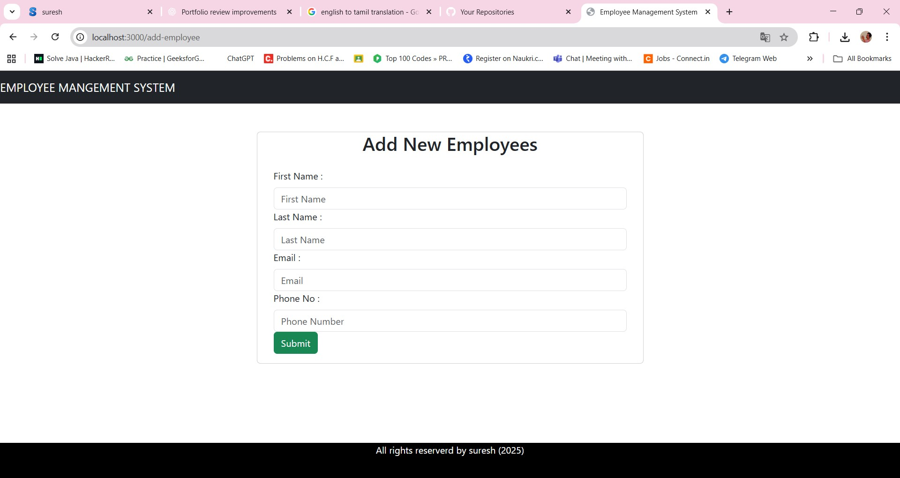
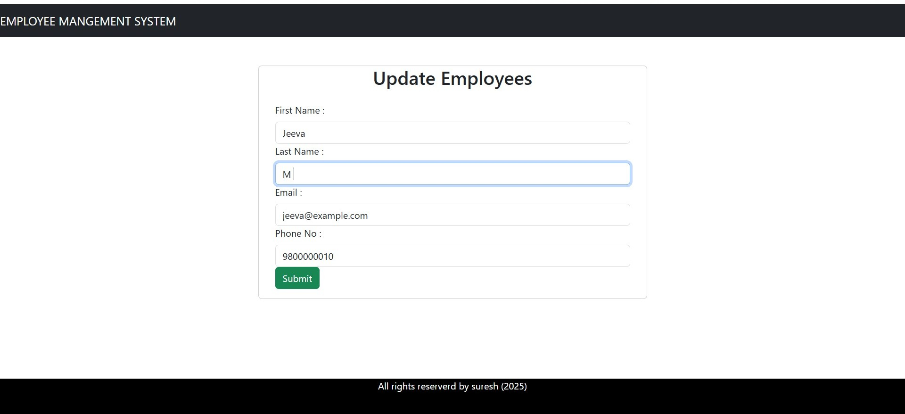
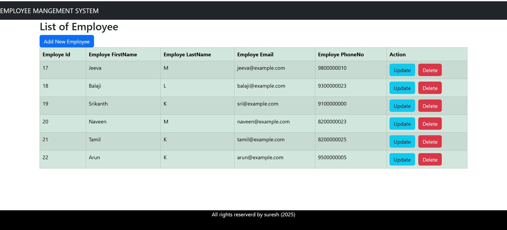
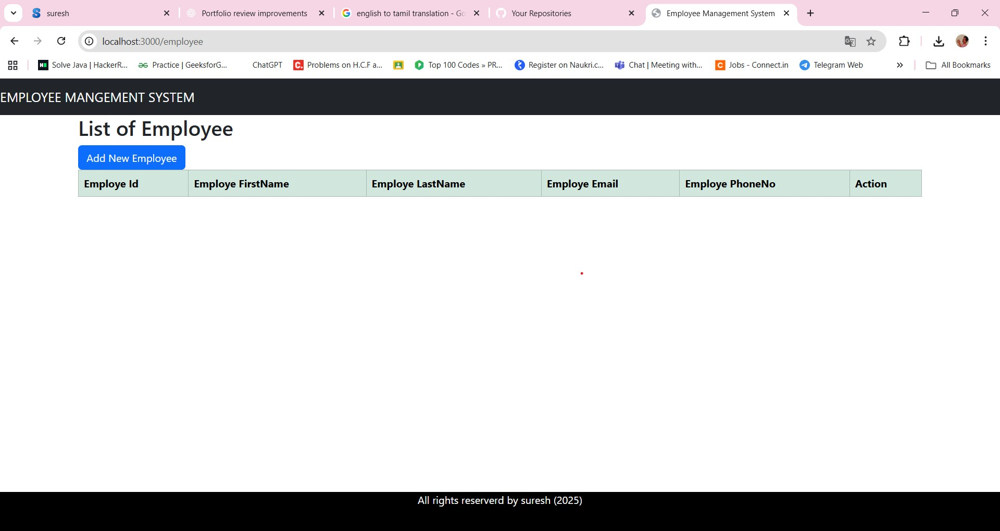

                                             👨‍💼 Employee Management System
📖 Project Overview
The Employee Management System is a full-stack web application designed to perform CRUD (Create, Read, Update, Delete) operations on employee records. Along with basic details (name, email, phone).
This project demonstrates a complete workflow of handling employee data with using a React frontend and a Spring Boot + MySQL backend.
________________________________________
✨ Features
•	➕ Create Employee – Add new employee 
•	✏️ Update Employee – Edit employee details 
•	👀 View Employee – Display employee details 
•	❌ Delete Employee – Remove employee record 
________________________________________
🛠 Tech Stack
Frontend
•	⚛️ React.js
•	🎨 HTML5, CSS3
•	💻 JavaScript
•	📡 Axios (API calls)
Backend
•	☕ Java
•	🌱 Spring Boot (REST APIs)
•	🗄 Hibernate / JPA
•	🐬 MySQL Database
Tools
•	🧑‍💻 VS Code (Frontend)
•	🛠 IntelliJ IDEA (Backend)
•	🧪 Postman (API testing)
•	🌐 Git & GitHub (Version Control)
________________________________________
⚙️ CRUD Operations Workflow
1️⃣ Create Employee
•	Form to enter employee details (name, email, phone)
•	Data stored in MySQL and  backend server
   
2️⃣ Update Employee
•	Edit existing employee details
•	Option to upload a new details to replace old one
  
 
3️⃣ View Employee
•	Display list of all employees
 
 
4️⃣ Delete Employee
•	Delete employee record from database
 
 

